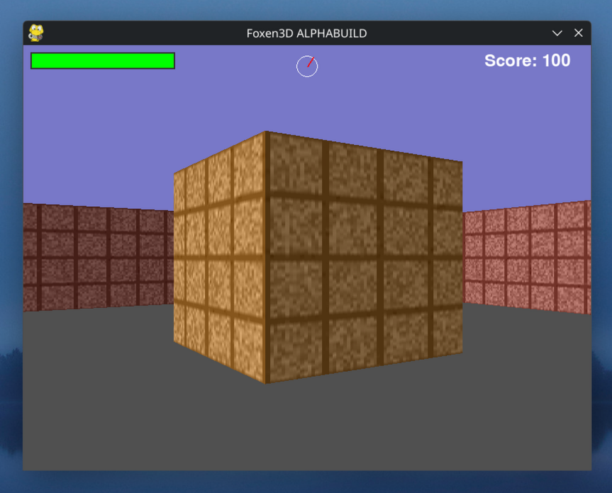

# F0XEN3D

[More Screenshoots](Screenshots.md)

The World's Smallest 3D Game (smaller than .kkrieger by ~2 times)

 Python Version

## ALPHA VERSIONS (LOSTMEDIA):

alphalastest (ALPHABUILD) - 16.2 KiB   smaller than .kkrieger by 5.7 times

## RELEASE VERSIONS:

v0.1 - 26.1 KiB smaller than .kkrieger by 3.5 times

v0.2 - 30.8 KiB smaller than .kkrieger by 3 times

v0.3 (UNPLAYABLE) - 47.8 KiB smaller than .kkrieger by 1.9 times

v0.4 - 48.4 KiB smaller than .kkrieger by 1.9 times

v0.5.0 (UNPLAYABLE) - 43.7 KiB smaller than .kkrieger by 2.1 times

v0.5.0 (FIXED) (laggy) - 43.9 KiB smaller than .kkrieger by 2.1 times

v0.5.1 - 44.0 KiB smaller than .kkrieger by 2.1 times

